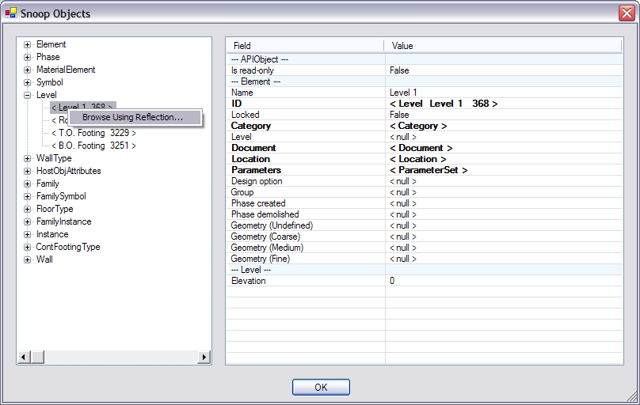
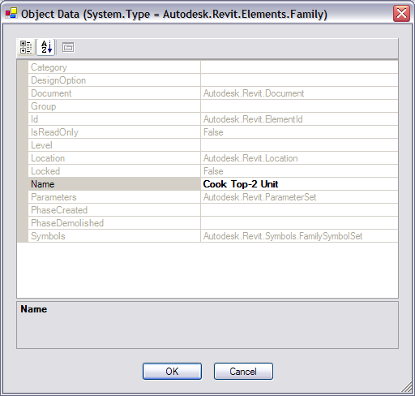

# Revit Lookup (Formerly known as RvtMgdDbg)

Jim Awe
<br/>Autodesk, Inc.
<br/>05/11/2005

<p style="color:red">Warning, this document is currently obsolete.</p>

08808006 [Revit SDK documentation outdated...]

Contains outdated or non-functional information regarding creating the 'RevitLookup.addin' file and the associated file which belong in the addins folder. (If you cut and paste the suggested text as from RevitLookup.doc to create RevitLookup.addin it will fail when Revit starts)

In 2012 SDK, there is a compiled DLL file, and a working Addin file.

In the 2013 SDK, there is no compiled DLL file (or instructions on compiling DLL), and there is no Addin file.

In the 2014 SDK there is no compiled DLL file (or instructions on compiling DLL), but there is an Addin file.

In all three cases, the date listed for the Documentation (Word Doc) is 05/11/2005, and much of the information is out of date.

</span>

Revit Lookup is a program designed with several goals:

- To provide a comprehensive test of the Managed API of Revit
- To provide sample code and utility classes for 3rd Party developers
- To provide “scaffolding” for quick tests of issues when they arise
- To aid my own learning experience on the Revit API

Currently, the following commands exist (all accessed from the “External Tools” menu):


## Hello World...

The classic bare-bones test.  Just brings up an Alert box to show that the connection to the external module is working.

## Snoop DB...


This command allows you to browse all of the Elements within the current document and view their exposed properties.  There has to be code written to extract all the individual properties of an object.  As a result, when new classes or methods are added to the system, they will not be visible until code is explicitly written to display them.  Because, the properties of an object are obtained in a top-down manner, all object types will at least be able to display common base class properties, even when newly added.

When an item in the data list appears in bold typeface, it means that there is “Drill down” information.  Click on that row and a nested Form (Dialog Box) will bring up more detailed information about that data item.  For instance, clicking on any item that lists a ParameterSet will bring up a nested Form displaying the contents of the set.

NOTE: when “Drilling down”, the Forms will stack on top of each other.  You could keep drilling down a long way if you aren’t paying attention.  It is up to you to make sure you don’t get lost in all of the stacked up Forms.

The DrillDown information on a Class Separator (the light blue lines), will allow you to view information about the given class.


Also, in the left-hand pane, you can right-click on a particular object and get additional information.



Choosing “Browse Using Reflection...” will bring up a Generic PropertyGrid Form that uses .NET Reflection to browse all the properties.  Here, there is no code written specifically in Revit Lookup to retrieve, format, and display the properties.



NOTE: Because we have no control over how items are displayed, read-only values appear in Grey, and editable values appear in Bold.  This form is not setup to correctly handle edits, so making changes is completely at your own risk.

You can continue to browse generically using Reflection if you right-click on one of the items in the PropertyGrid.  You get options to see either the Class info or the Object info.

## Snoop Current Selection...

Same as the above command, except that it starts you off Snooping only the elements that were part of the current selection set.

## Snoop Application...

Same as above, except that you start out at the Autodesk.Revit.Application object which is originally passed to the command.

## Test Framework ...

This command packages a set of individual tests into a single location.  As new tests are written, they are plugged into this same Form without the need to define new external commands and hook them up to the system.  The black “CLS” nodes of the tree represent which Class the tests concern.  The grey check mark nodes represent an individual test.  To run a test, simply choose a check mark node and press OK.

As of now, there are only a few tests, but more will be added over time.


## Set Up

The Revit API now offers the ability to register API applications via an .addin manifest file.

Manifest files will be read automatically by Revit when they are places in one of two locations on a user's system:

- In a non-user specific location in "application data"
    - For Windows XP &ndash; *C:\Documents and Settings\All Users\Application Data\Autodesk\Revit\Addins\2012\*
    - For Vista/Windows 7 &ndash; *C:\ProgramData\Autodesk\Revit\Addins\2012\*
- In a user specific location in "application data"
    - For Windows XP &ndash; *C:\Documents and Settings\<user>\Application Data\Autodesk\Revit\Addins\2012\*
    - For Vista/Windows 7 &ndash; *C:\Users\<user>\AppData\Roaming\Autodesk\Revit\Addins\2012\*

All files named `.addin` in these locations will be read and processed by Revit during startup.

The content of RevitLookup.addin:

```
&lt;?xml version="1.0" encoding="utf-16" standalone="no"?&gt;
&lt;RevitAddIns&gt;
  &lt;AddIn Type="Application"&gt;
    &lt;Name&gt;RevitLookup&lt;/Name&gt;
    &lt;Assembly&gt;RevitLookup.dll&lt;/Assembly&gt;
    &lt;ClientId&gt;6066CBF6-9034-41dd-A2A6-B3761C1362FF&lt;/ClientId&gt;
    &lt;FullClassName&gt;RevitLookup.App&lt;/FullClassName&gt;
  &lt;/AddIn&gt;
&lt;/RevitAddIns&gt;
```

## Known Issues

As of this date, there are a few known issues:

- Random exceptions when browsing Forms.  There is a strange work-around in some of the Form constructors that seems to get around a lot of the exceptions, but there is still the occasional problem.  Usually, they give the exception message “Overflow or underflow operation”.  The exceptions are caught and you will be returned to the editor window and can continue.
- The Snoop XML Form seems to be especially flaky.  This was ported directly over from the AutoCAD version of MgdDbg, so I’m not sure what the deal is yet because it seems much more stable over there.
- Trying to get the Analytical model of walls if they aren’t a load-bearing wall causes an Assert.  Simply click on “Ignore All” and it won’t bother you anymore.
- Trying to get the Room or analytical model of a FamilyInstance asserts that the TopologyId is incorrect.  Simply click on “Ignore All” and it won’t bother you anymore. 
